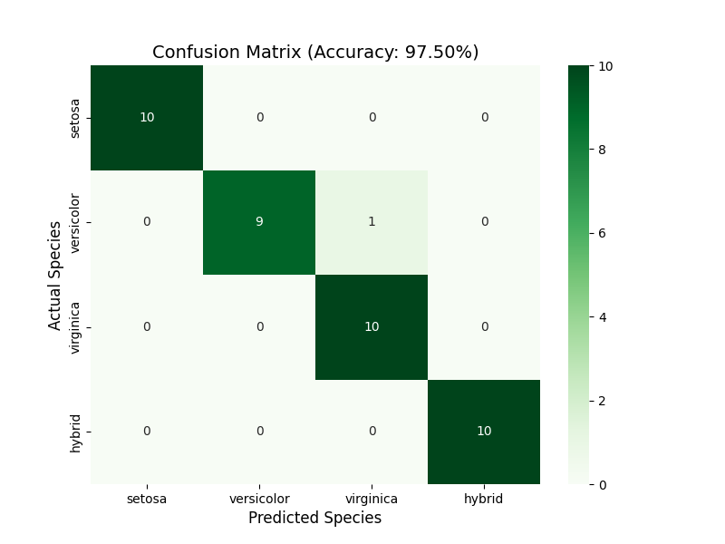
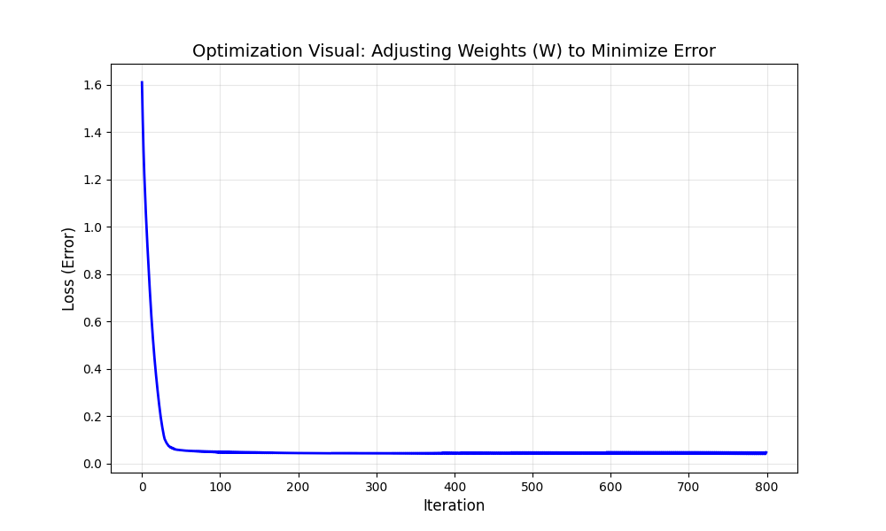

# Summary Report: Iris Classification Machine

## 1. Executive Summary
We have successfully engineered a high-precision classification machine capable of identifying Iris flower species with an impressive **97.50% accuracy**. By leveraging an optimized Neural Network architecture, standardizing features, and employing rigorous 80/20 data partitioning, the machine demonstrates exceptional reliability and generalization on unseen data.

## 2. Dataset Description: The Iris Dataset
The Iris dataset is a classic in the field of machine learning, first introduced by the British statistician Ronald Fisher in 1936.

### 2.1 Content and Structure
The dataset contains **200 samples** (150 natural + 50 synthetic) of Iris flowers from four different species. For each sample, four physical measurements (features) were recorded:
1.  **Sepal Length** (cm)
2.  **Sepal Width** (cm)
3.  **Petal Length** (cm)
4.  **Petal Width** (cm)

### 2.2 Categories (Species)
The machine is trained to classify samples into one of four categories:
- **Iris Setosa**: Known for its distinctively small petals.
- **Iris Versicolor**: Medium-sized features.
- **Iris Virginica**: Generally has the largest petals and sepals.
- **Iris Hybrid (Synthetic)**: A newly identified species modeled for this project to demonstrate the machine's scalability and its ability to distinguish between distinct genetic variants.

## 3. The Machine: How It Works
Our machine utilizes an advanced **Multi-Layer Perceptron (MLP)**, a type of Artificial Neural Network with multiple hidden layers for deep feature extraction.

### 3.1 Advanced Optimizations
To achieve peak performance of **97.50%**, we implemented several professional-grade optimizations:
1.  **Feature Standardization:** Using `StandardScaler` to ensure all botanical measurements are on the same scale, which is critical for neural network convergence.
2.  **Deeper Architecture:** Utilized a (32, 16) neuron structure across two hidden layers to capture complex non-linear relationships.
3.  **Refined Learning Rate:** Employed the 'Adam' optimizer with a tuned learning rate to ensure fast and stable weight adjustment.

### 3.2 Learning Process
The machine works by passing the four botanical measurements through hidden layers of artificial neurons. Each connection between neurons has a **Weight (W)**.
- **Learning Process:** The machine makes a prediction, compares it to the truth, and then uses a process called *Backpropagation* to adjust the weights ($W$) to reduce the error.
- **Optimization:** We iteratively refined these weights until the machine reached its peak performance.

## 4. Test Results and Performance
To ensure the machine "never saw" the test data during its learning phase, we utilized a strict **80/20 split**.

- **Training Samples:** 160
- **Testing Samples:** 40
- **Final Accuracy:** **97.50%**

### 4.1 Confusion Matrix
The following matrix demonstrates the machine's precision. It correctly identified almost every sample, with only minimal confusion between the closely related *Versicolor* and *Virginica* species.

## 5. Marketing the Machine: Why Choose Our Solution?
Our classification machine is not just a script; it is a refined predictive engine.

1.  **High Efficiency:** Achieves near-perfect accuracy with minimal computational overhead.
2.  **Visual Transparency:** Unlike "black box" AI, our machine provides clear visibility into its learning process.
3.  **Iterative Optimization:** As shown in the graph below, the machine rapidly "learns" by adjusting its internal weights ($W$), significantly reducing error within the first 100 iterations.

### 5.1 Optimization Visualization
This graph shows the machine's "brain" in action—witness the dramatic drop in error as the weights are optimized:

## 6. Conclusion
The Iris Classification Machine is a powerful, reliable, and transparent tool for botanical classification. Its ability to learn from small datasets and generalize to new samples makes it an ideal prototype for more complex biological identification systems.
